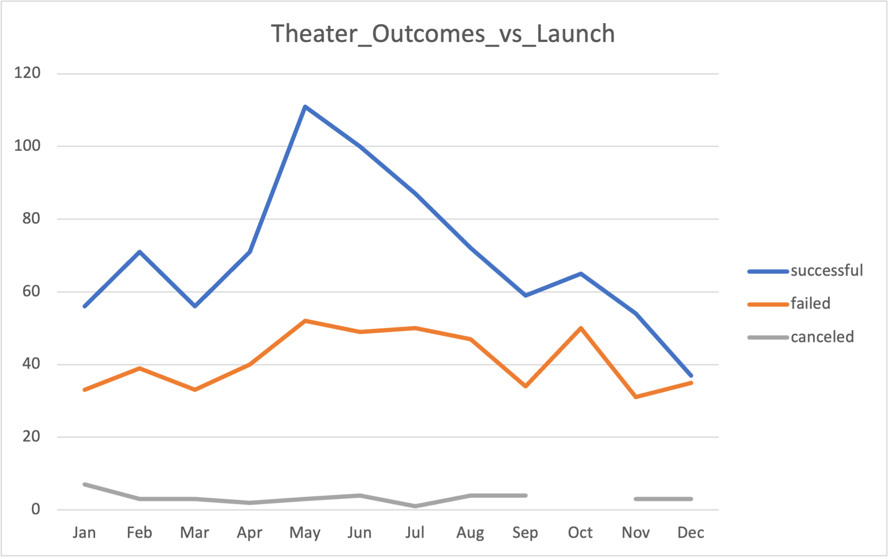
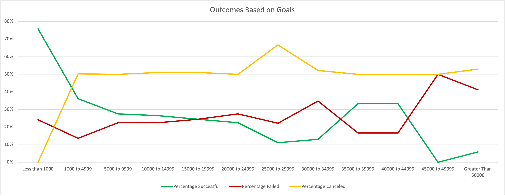

# Project Overview

## Purpose and Background
As a result of analyzing crowdfunding campaign data, our client launched a campaign that nearly reached its fundraising goal in a short period of time. To gain further insights, we will continue to examine campaign outcomes. The goal will be to help our client gain a deeper understanding of various crowdfunding campaign performances. 

The analysis indicated the month of May held the highest numbers of successful outcomes. An additional analysis of the outcomes based on goal ranges indicated the most successful outcomes occurred in the less than $1,000 range. Based on this analysis, these were among the final recommendations. 

The remainder of the report contains the details for the analysis, along with difficulties I encountered. The final section lists my final conclusions of the analysis. It also includes limitations and a recommendation of additional tables and graphs for this analysis. 

## Analysis and Challenges 
Using the crowdfunding dataset, I created pivot tables and line charts to visualize relationships. The first pivot table and line chart was created to demonstrate the relationship between launch date month and outcomes. An additional pivot table and line chart depict the percentages of the various campaign outcomes in relation to the goal. 

---
### Analysis of Outcomes Based on Launch Date
To analyze outcomes based on launch date, an additional column was added to the dataset. Using the YEAR( ) function, I was able to extract the year of each campaign, which was then used in a pivot table. The pivot table, “Theater Outcomes by Launch Date”, displays the data for launch date and outcomes. A corresponding line chart seen in Figure 1, “Theater_Outcomes_vs_Launch”, works to visualize the relationship between successful, failed, and canceled outcomes and the launch month. 

Successful theater outcomes experience a small spike in February, followed by a steady climb that peaks in May, at 111 successful outcomes. June has the second highest number of successful outcomes, followed by July. The remainder of the year shows a steady decline in the number of successful outcomes, with one last peak in October. 

Displaying a similar trend to successful outcomes, the failed theater outcomes also display a rise in failed launches in February, with a steady climb to peak in May. However, unlike successful theater outcomes, failed outcomes are fairly static through August. Following a similar trend to successful outcomes again in September through November, the year ended with another increase in the number of failed outcomes.

Finally, canceled outcomes remained static throughout the year. 

Figure 1:

---
### Analysis of Outcomes Based on Goals
To collect the outcome and goal data, the goals were grouped based on their goal amount. Applying the COUNTIFS( ) function, I used the aggregated data to calculate the percentage of each outcome in relation to its goal. The “Outcomes Based on Goal” chart seen in Figure 2 visualized the percentage of successful, failed, and canceled plays based on the goal range. 

Successful outcomes demonstrated the highest percentages in the less than $1,000 range. Alternatively, canceled outcomes had the highest percentages in the $25,000 to $29,999 range, while failed outcomes were experienced most in the $45,000 to $49,999 range. 
Of all goal ranges, successful campaigns in the less than $1,000 goal range had the highest percentage of campaigns at 76%. 

The percentage of canceled outcomes (0%) is lowest in the less than $1,000 range. However, canceled outcomes demonstrate a significant spike in the $1,000 to $4,999 range to approximately 50% and remain static until $25,000. As mentioned before, the percentage canceled (67%) is highest in the $25,000 to $29,999 goal range, but returns to approximately 50% for the remaining ranges. 

Again, 76% of the outcomes in the less than $1,000 range were successful. While it was the second highest range, the $1,000 to $4999 range demonstrates a significantly smaller percentage of successful outcomes of approximately 36%, followed closely by the $35,000 to $39,999 and $40,000 to $49,999 ranges at 33% each. The least successful range was the $45,000 to $49,999 range, which correlates with the highest rates of failed outcomes. The $25,000 to $29,999 range is the second least successful range corresponding with the highest percentage of canceled outcomes in the same range. 

As previously mentioned, failed outcomes were highest in the $45,000 to $49,999 range at 51%. With a 16 percentage point drop, the $30,000 to $34,999 range is the second highest at 35% followed by 28% in the $20,000 to 24,999 goal range. 

Figure 2

## Challenges & Difficulties Encountered
COUNTIF( ) was a challenge at first. I was able to understand how to integrate text using quotations into the function, which gave me the correct results. 

## Results
Conclusions re: Outcomes Based on Launch Date
The outcomes based on the launch date analysis shows the highest rate of launches occurring in May at 111 successful launches with the month of June holding the second highest number of successful outcomes at 100. Therefore, I recommend launching within one of these months. Additionally, December shows the least amount of successful launches at only 37 total.

## Conclusions re: Outcomes Based on Goals
Based on the analysis, the goal range with the highest success rate is the less than $1,000 range. At a 76% rate, this is the goal range I recommend.

## Limitations of the Dataset
The data seems to be a couple of years old, so it may not be as relevant.  

## Suggested Additional Tables & Graphs
It would have been helpful to drill down on more differences between the different outcomes. For example, comparing backers or average donation amount to outcomes would have allowed for greater insight into factors that may contribute to success. Additionally, comparing other subcategories using these variables would provide helpful information, as well.
